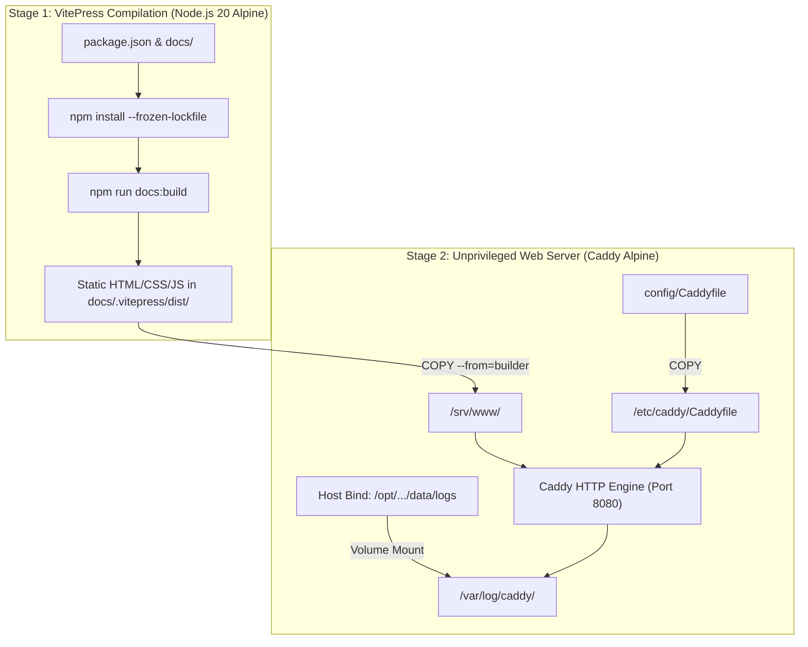

# SDD-001: Star Trek NX-01 Operations Portal Implementation Design

## 1. Executive Summary & Policy Distillation

### 1.1 Context & Purpose
This Software Design Document specifies the architecture, build pipeline, and file structure for transforming `docker-hello-world` into a self-contained **Star Trek: Enterprise (NX-01) Starfleet Operations Portal** using VitePress and Caddy.

This application serves as the canonical canary deployment vehicle to validate the Homelab Systems Lifecycle (HSL) and Software Development Practice (SDP) architecture codified in ADR 0025:
* Multi-stage container compilation via `Dockerfile`.
* Publication of versioned, immutable images to GitHub Container Registry (`ghcr.io`).
* Runtime environment and secret injection via `.env`.
* Volume bind mounting and unprivileged access logging.
* Native Docker and HTTP healthcheck validation.

### 1.2 Non-Goals
* This document does NOT manage Ansible playbooks or target host provisioning in `homelab-ops`.
* This document does NOT require server-side database backends or dynamic compute runtimes; dynamic environmental context is resolved at build time or via static client-side asset inspection.

---

## 2. Architectural Blueprint & Structural Models

### 2.1 Multi-Stage Container Build Architecture



### 2.2 Container Runtime & Ports Contract

| Component | In-Container Path | Host Bind / Mapping | Permissions / User |
| :--- | :--- | :--- | :--- |
| **Static Content** | `/srv/www/` | Bundled in container image | `caddy:caddy` (1000:1000) |
| **Server Config** | `/etc/caddy/Caddyfile` | Bundled in container image | Root read-only (`0644`) |
| **Access Logs** | `/var/log/caddy/` | Host mount: `data/logs` | `1000:1000` (`0750`) |
| **HTTP Port** | `8080` (Internal) | `8080:8080` (or `PORT` via `.env`) | Unprivileged |

---

## 3. Data & Configuration Contracts

### 3.1 Environment Specification (`.env.example`)
The application defines three configurable environment properties:
* `PORT`: Host listening port (default: `8080`).
* `STARFLEET_VESSEL`: Name of the starship vessel (default: `NX-01 Enterprise`).
* `WARP_CORE_AUTHORIZATION_CODE`: Secret authorization string injected in production (default: `NX-TEST-0000`).

### 3.2 Health Check Specification
* **Command:** `wget --no-verbose --tries=1 --spider http://localhost:8080/ || exit 1`
* **Interval:** 10s
* **Timeout:** 3s
* **Retries:** 3
* **Start Period:** 5s

---

## 4. Step-by-Step Implementation Guide

Follow these steps directly inside `/home/michael/src/github.com/mnaatjes/docker-hello-world/`.

### Step 1: Initialize VitePress Project Scaffolding

Create `package.json` with VitePress dependencies:

```json
{
  "name": "docker-hello-world",
  "version": "1.0.0",
  "description": "Star Trek NX-01 Operations Portal",
  "type": "module",
  "scripts": {
    "docs:dev": "vitepress dev docs",
    "docs:build": "vitepress build docs",
    "docs:preview": "vitepress preview docs"
  },
  "devDependencies": {
    "vitepress": "^1.0.1"
  }
}
```

Create directory layout:
```bash
mkdir -p docs/.vitepress docs/operations docs/engineering
```

---

### Step 2: Configure VitePress Theme & Navigation

Create `docs/.vitepress/config.js`:

```javascript
import { defineConfig } from 'vitepress'

export default defineConfig({
  title: 'Starfleet Command: NX-01',
  description: 'United Earth Starfleet Operations Portal - NX-01 Enterprise',
  themeConfig: {
    nav: [
      { text: 'Bridge', link: '/' },
      { text: 'Engineering', link: '/engineering/' },
      { text: 'Operations', link: '/operations/' }
    ],
    sidebar: [
      {
        text: 'Vessel Systems',
        items: [
          { text: 'Bridge Overview', link: '/' },
          { text: 'Warp Five Engine', link: '/engineering/' },
          { text: 'Sensors & Comms', link: '/operations/' }
        ]
      }
    ],
    socialLinks: [
      { icon: 'github', link: 'https://github.com/mnaatjes/docker-hello-world' }
    ],
    footer: {
      message: 'United Earth Space Probe Agency (UESPA) / Starfleet Command',
      copyright: 'NX-01 Enterprise - Warp Delta Testing'
    }
  }
})
```

---

### Step 3: Author NX-01 Portal Content Pages

#### 3.1 Portal Homepage: `docs/index.md`

```markdown
---
layout: home

hero:
  name: "Starfleet Operations"
  text: "NX-01 Enterprise Portal"
  tagline: "United Earth Starship - First Warp 5 Capable Vessel"
  actions:
    - theme: brand
      text: Warp Propulsion Telemetry
      link: /engineering/
    - theme: alt
      text: Flight Operations Logs
      link: /operations/

features:
  - title: Warp Propulsion
    details: Dual-reaction matter/antimatter reactor developed by Henry Archer and Zefram Cochrane.
  - title: Polarized Hull Plating
    details: High-energy electromagnetic reinforcement providing tactical defense against particle weapons.
  - title: Spatial Torpedoes
    details: Forward and aft launch tubes equipped with variable-yield guided warheads.
---
```

#### 3.2 Engineering Page: `docs/engineering/index.md`

```markdown
# Engineering Division: Warp Propulsion

## Warp Core Status
* **Vessel Designation:** NX-01 Enterprise
* **Engine Type:** Warp 5 Engine (Matter/Antimatter)
* **Chief Engineer:** Commander Charles "Trip" Tucker III
* **Theoretical Maximum Velocity:** Warp 5.2 (Temporary burst)

## Safety Protocols & Plasma Flow
1. Dilithium matrix alignment must be inspected every 50 hours of continuous warp flight.
2. Plasma injectors must be flushed prior to entering dense nebulae.
```

#### 3.3 Operations Page: `docs/operations/index.md`

```markdown
# Flight Operations & Navigation

## Subspace Transceiver Status
* **Primary Frequency:** 1420.405 MHz (Hydrogen line fallback)
* **Subspace Relay Network:** Earth-Alpha Sector Link (Latency: 14.2 minutes at 1 light-year)

## Current Mission Parameters
* **Commanding Officer:** Captain Jonathan Archer
* **Primary Mission:** Deep space exploration of the Vulcan, Andorian, and Klingon borders.
```

---

### Step 4: Configure Web Server & Logging (`config/Caddyfile`)

Replace `config/sample.conf` with `config/Caddyfile`:

```caddy
:8080 {
    root * /srv/www
    file_server

    log {
        output file /var/log/caddy/access.log {
            roll_size 10mb
            roll_keep 3
        }
    }

    handle_errors {
        respond "{err.status_code} - Subspace Signal Lost"
    }
}
```

---

### Step 5: Author Multi-Stage `Dockerfile`

Update `Dockerfile` with the dual-stage build:

```dockerfile
# Stage 1: Build static documentation
FROM node:20-alpine AS builder

WORKDIR /build

COPY package.json package-lock.json* ./
RUN npm install

COPY docs/ ./docs/
RUN npm run docs:build

# Stage 2: Serve via unprivileged Caddy
FROM caddy:2-alpine

WORKDIR /srv/www

# Copy static assets from builder stage
COPY --from=builder /build/docs/.vitepress/dist /srv/www

# Copy server configuration
COPY config/Caddyfile /etc/caddy/Caddyfile

# Ensure log directory exists and is writable
RUN mkdir -p /var/log/caddy && chown -R 1000:1000 /var/log/caddy

EXPOSE 8080

HEALTHCHECK --interval=10s --timeout=3s --retries=3 --start-period=5s \
  CMD wget --no-verbose --tries=1 --spider http://localhost:8080/ || exit 1

CMD ["caddy", "run", "--config", "/etc/caddy/Caddyfile", "--adapter", "caddyfile"]
```

---

### Step 6: Configure Multi-Container `compose.yml`

Update `compose.yml` declaring ports, volumes, and healthchecks:

```yaml
---
services:
  portal:
    image: ${IMAGE_NAME:-ghcr.io/mnaatjes/docker-hello-world:v1.0.0}
    build:
      context: .
      dockerfile: Dockerfile
    container_name: docker-hello-world
    restart: unless-stopped
    ports:
      - "${PORT:-8080}:8080"
    environment:
      - STARFLEET_VESSEL=${STARFLEET_VESSEL:-NX-01 Enterprise}
      - WARP_CORE_AUTHORIZATION_CODE=${WARP_CORE_AUTHORIZATION_CODE:-NX-DEFAULT-0000}
    volumes:
      - ./data/logs:/var/log/caddy
    healthcheck:
      test: ["CMD-SHELL", "wget --no-verbose --tries=1 --spider http://localhost:8080/ || exit 1"]
      interval: 10s
      timeout: 3s
      retries: 3
      start_period: 5s
```

---

### Step 7: Update Environment Specification (`.env.example`)

Update `.env.example`:

```bash
# Server Port Configuration
PORT=8080

# Starfleet Fleet Telemetry
STARFLEET_VESSEL=NX-01 Enterprise

# Security Authorization (Injected via Ansible Vault in Production)
WARP_CORE_AUTHORIZATION_CODE=NX-OMEGA-9821
```

---

### Step 8: Configure Automated Image Build & Publish in GitHub Actions

Update `.github/workflows/ci.yml` (or create `.github/workflows/release.yml`) to automatically build and publish multi-arch container images to GitHub Container Registry on tag pushes:

```yaml
name: Build and Publish Container Image

on:
  push:
    tags:
      - 'v*'

jobs:
  build-and-push:
    runs-on: ubuntu-latest
    permissions:
      contents: read
      packages: write

    steps:
      - name: Checkout Repository
        uses: actions/checkout@v4

      - name: Log in to GitHub Container Registry
        uses: docker/login-action@v3
        with:
          registry: ghcr.io
          username: ${{ github.actor }}
          password: ${{ secrets.GITHUB_TOKEN }}

      - name: Extract Docker Metadata
        id: meta
        uses: docker/metadata-action@v5
        with:
          images: ghcr.io/mnaatjes/docker-hello-world
          tags: |
            type=semver,pattern={{version}}

      - name: Build and Push Docker Image
        uses: docker/build-push-action@v5
        with:
          context: .
          push: true
          tags: ${{ steps.meta.outputs.tags }}
          labels: ${{ steps.meta.outputs.labels }}
```

---

### Step 9: Local Verification Testing

Run locally on your workstation to verify the build and healthcheck:

```bash
# 1. Build and start container locally
docker compose up --build -d

# 2. Check container status and health
docker compose ps

# 3. Test HTTP endpoint reachability
curl -I http://localhost:8080

# 4. Confirm log volume creation
ls -la data/logs/access.log

# 5. Tear down test instance
docker compose down
```

---

### Step 10: Tag and Push Release

Once locally verified and all linter checks pass:

```bash
git add .
git commit -m "feat: implement Star Trek NX-01 VitePress operations portal"
git push origin main

git tag -a v1.0.0 -m "Release v1.0.0: Starfleet NX-01 Operations Portal"
git push origin v1.0.0
```
